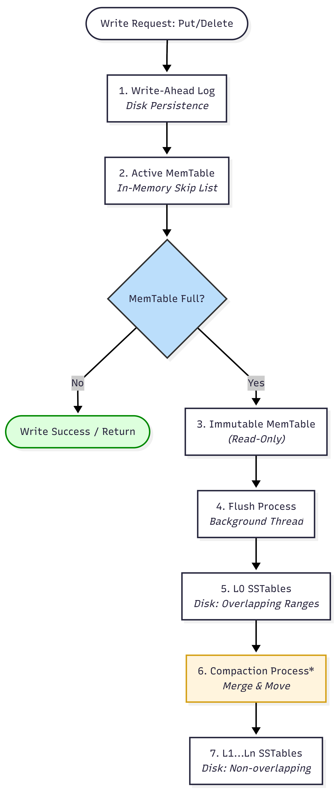

# RocksDB-Compaction

**202518048 — Rajvi**

---


## Table of Contents
- [System Overview](#system-overview)
  - [What is RocksDB ?](#what-is-rocksdb-)
  - [What is Compaction ?](#what-is-compaction-)
  - [Why Compaction Exists ? (Motivation)](#why-compaction-exists--motivation)
- [Execution Path - Complete Trace](#execution-path---complete-trace)
- [Compaction Algorithm](#compaction-algorithm)
- [Design Decisions](#design-decisions)
- [Concept Mapping](#concept-mapping)
- [Experiments](#experiments)
- [Failure Analysis](#failure-analysis)
- [References](#references)

---

# System Overview

### What is RocksDB ?
RocksDB is an embedded key-value **storage engine** based on the Log-Structured Merge (LSM) tree design developed by Facebook, based on Google’s LevelDB. It is designed for fast writes and is widely used in production systems such as CockroachDB, MyRocks, and many other stateful services.  

It is optimized for high write throughput by converting random writes into **sequential** disk operations. Unlike traditional databases, it runs as a library inside applications. The tradeoff is that additional work (compaction) is required to maintain read performance and storage efficiency.  




### What is Compaction ?
- **Definition:**  
  Compaction is a background process in RocksDB that merges multiple SST files into new sorted files at the next level. It reads data from existing files, combines them using a merge process, and writes optimized output files. This operation runs in the background without blocking writes.

- **What it does internally:**  
  During compaction, duplicate keys are resolved by keeping only the latest version, and deletion markers (tombstones) are removed when no longer needed. This ensures that data remains clean, sorted, and efficient for lookup operations across levels.

### Why Compaction Exists ? (Motivation)
- **Reduce read amplification**  
  Without compaction, many SST files (especially in L0) must be checked for every read, increasing latency. Compaction merges files and reduces the number of lookups needed.  

- **Remove stale and deleted data**  
  Multiple versions of the same key and deletion markers accumulate over time. Compaction removes outdated entries and frees disk space.  

- **Maintain structured storage**  
  As new data is continuously written, the system becomes fragmented. Compaction reorganizes data into sorted, non-overlapping levels, keeping the storage efficient and scalable.

---

# Compaction Execution Path — Complete Trace

> **Tool used:** `ldb` — RocksDB's official command-line admin tool  
> **Install:** `sudo apt-get install rocksdb-tools`  
> **All commands below are copy-paste runnable in any bash terminal**

---

## Overview — The Six Stages of One Compaction Cycle

```
STAGE 1      STAGE 2        STAGE 3       STAGE 4          STAGE 5       STAGE 6
─────────    ──────────     ──────────    ─────────────    ──────────    ──────────
TRIGGER  →  DISPATCH   →   PICKING   →  MERGE LOOP   →   INSTALL   →   CLEANUP
What fires   Thread pool    Score all     K-way merge,     VersionEdit   Old SSTs
compaction   scheduling     levels,pick   key decisions,   + MANIFEST    deleted
             + gating       files         emit output      write         from disk
```
---

## 2.2 Detailed Code-Level Trace

---

### Stage 1 — Trigger

**Function:** `DBImpl::MaybeScheduleFlushOrCompaction()`
**File:** `db/db_impl/db_impl_compaction_flush.cc`

Called after every flush and after every compaction completes.
Checks whether L0 file count ≥ `level0_file_num_compaction_trigger` (default 4)
or any level's score ≥ 1.0. If yes, dispatches a background compaction task.

```bash
# Setup — write 20 keys to fill L0 with overlapping SST files
rm -rf /tmp/rocksdb_demo && mkdir -p /tmp/rocksdb_demo

for i in $(seq 1 20); do
  ldb --db=/tmp/rocksdb_demo --create_if_missing \
      put "key$(printf '%03d' $i)" "value_$i"
done
```

```bash
# Confirm trigger thresholds — logged by RocksDB at DB open
grep -E "compaction_trigger|slowdown_writes|stop_writes" /tmp/rocksdb_demo/LOG
```

**Expected output:**
```
Options.level0_file_num_compaction_trigger: 4
Options.level0_slowdown_writes_trigger: 20
Options.level0_stop_writes_trigger: 36
```

> With 19 L0 files, the trigger threshold of 4 was crossed at the 4th write.
> At 20 files, write slowdown is active. At 36, writes halt completely.

---

### Stage 2 — Dispatch

**Function:** `DBImpl::BackgroundCallCompaction()` → `DBImpl::BackgroundCompaction()`
**File:** `db/db_impl/db_impl_compaction_flush.cc`

`MaybeScheduleFlushOrCompaction()` submits `BGWorkCompaction` to the low-priority
thread pool via `Env::Schedule()`. The calling thread returns immediately.
`BackgroundCallCompaction()` holds the DB mutex only for picking and installing —
the actual merge I/O runs without the mutex so foreground reads/writes continue.

```bash
# Confirm thread pool config
grep -E "max_background_compactions|max_subcompactions" /tmp/rocksdb_demo/LOG
```

**Expected output:**
```
Options.max_background_compactions: -1
Options.max_subcompactions: 1
```

> `-1` = RocksDB auto-tunes thread count.
> `max_subcompactions = 1` = no parallel subcompaction by default.
> Flush jobs run on a separate HIGH-priority pool so they never block compaction.

---

### Stage 3 — Picking

**Function:** `LevelCompactionPicker::PickCompaction()`
**File:** `db/compaction/compaction_picker_level.cc`

**Supporting:** `VersionStorageInfo::ComputeCompactionScore()`
**File:** `db/version/version_storage_info.cc`

Scores every level. Selects the highest-score level as input (Lb). Picks a specific
file via a round-robin cursor (`compact_pointer_`) for even key-range coverage.
Expands the file set to a "clean cut" — no user key is split across the boundary.
Finds all overlapping files in the output level (Lo = Lb + 1).

```bash
# Trigger compaction (same internal path as automatic)
ldb --db=/tmp/rocksdb_demo compact
```

```bash
# See which files the picker selected as inputs
grep -E "Compaction start summary|JOB.*Compacting" /tmp/rocksdb_demo/LOG | tail -3
```

**Expected output:**
```
[compaction_job.cc:2079] [JOB 4] Compacting 30@6 files to L6, score -1.00
[compaction_job.cc:2085] Compaction start summary: Base version 3 Base level 6,
  inputs: [8(1022B) 13(1022B) 18(1022B) 23(1022B) ...]
```

```bash
# Level scoring formula visible in Compaction Stats
grep -A 3 "Compaction Stats" /tmp/rocksdb_demo/LOG | head -5
```

> Score formula:
> - L0:  `score = file_count / level0_file_num_compaction_trigger` = 19/4 = **4.75**
> - L1+: `score = actual_bytes / target_bytes` = 0/256MB = **0.0**
>
> L0 wins. All L0 files selected (they all overlap → clean-cut requires all of them).

---

### Stage 4 — Merge Loop

**Function:** `CompactionJob::Run()` → `ProcessKeyValueCompaction()`
**File:** `db/compaction/compaction_job.cc`

**Key decision logic:** `CompactionIterator::NextFromInput()`
**File:** `db/compaction/compaction_iterator.cc`

Builds a `MergingIterator` (k-way min-heap over all input SST iterators).
For every `InternalKey` the iterator yields, `CompactionIterator` decides:
drop stale version, drop tombstone at bottommost level, or emit to output SST.

#### 4a — Stale Version Demo

```bash
rm -rf /tmp/rocksdb_versions && mkdir -p /tmp/rocksdb_versions

# Three writes to the same key = three versions on disk
ldb --db=/tmp/rocksdb_versions --create_if_missing put apple "red"
ldb --db=/tmp/rocksdb_versions put apple "green"
ldb --db=/tmp/rocksdb_versions put apple "yellow"

echo "--- BEFORE: SST file count ---"
ls /tmp/rocksdb_versions/*.sst | wc -l

ldb --db=/tmp/rocksdb_versions compact

echo "--- AFTER: SST file count ---"
ls /tmp/rocksdb_versions/*.sst | wc -l

echo "--- Value preserved ---"
ldb --db=/tmp/rocksdb_versions get apple
```

**Expected output:**
```
--- BEFORE: SST file count ---
2

--- AFTER: SST file count ---
1

--- Value preserved ---
yellow
```

```bash
grep -E "num_input_records|num_output_records" /tmp/rocksdb_versions/LOG | tail -2
```

**Expected output:**
```
"num_input_records": 2,  "num_output_records": 1
```

> MergingIterator yielded 2 InternalKeys for "apple" (seq=2 yellow, seq=1 red).
> `CompactionIterator`: seq=2 → **EMIT** (first version seen).
> `CompactionIterator`: seq=1 → **DROP** (stale, no live snapshot needs it).
> Output: 1 record. 2 SST files → 1.

---

#### 4b — Tombstone Demo

```bash
rm -rf /tmp/rocksdb_tomb && mkdir -p /tmp/rocksdb_tomb

ldb --db=/tmp/rocksdb_tomb --create_if_missing put key001 "hello"
ldb --db=/tmp/rocksdb_tomb put key002 "world"
ldb --db=/tmp/rocksdb_tomb put key003 "foo"

# delete writes kTypeDeletion InternalKey — does NOT remove data yet
ldb --db=/tmp/rocksdb_tomb delete key002

echo "--- BEFORE: SST file count ---"
ls /tmp/rocksdb_tomb/*.sst | wc -l

ldb --db=/tmp/rocksdb_tomb compact

echo "--- AFTER: SST file count ---"
ls /tmp/rocksdb_tomb/*.sst | wc -l

echo "--- Data correct ---"
ldb --db=/tmp/rocksdb_tomb scan
```

**Expected output:**
```
--- BEFORE: SST file count ---
4

--- AFTER: SST file count ---
1

--- Data correct ---
key001 ==> hello
key003 ==> foo
```

```bash
grep -E "num_input_records|num_output_records" /tmp/rocksdb_tomb/LOG | tail -2
```

**Expected output:**
```
"num_input_records": 4,  "num_output_records": 2
```

> Input: key001(value), key002(value), key002(**tombstone**), key003(value).
> At bottommost level: key002 tombstone has nothing to shadow → **DROP**.
> key002 value is older than its tombstone → **DROP**.
> key001 and key003 → **EMIT**. 4 records in, 2 out. Space reclaimed.

---

### Stage 5 — Install

**Function:** `CompactionJob::InstallCompactionResults()` → `VersionSet::LogAndApply()`
**File:** `db/version_set.cc`

Creates a `VersionEdit` listing files to delete (old inputs) and files to add
(new outputs). `LogAndApply()` appends the edit to the MANIFEST (crash-safe
append-only log), builds a new `Version`, and atomically installs it as current.
All subsequent `Get()` calls now use the new Version.

```bash
# MANIFEST shows the new LSM state after compaction
ldb --db=/tmp/rocksdb_tomb manifest_dump
```

**Expected output:**
```
--------------- Column family "default"  (ID 0) --------------
log number: 20
--- level 6 --- version# 1 ---
 28:1050[0 .. 0]['key001' seq:0, type:1 .. 'key003' seq:0, type:1]
next_file_number 30  last_sequence 4
```

```bash
grep -E "compacted to:|files in.*out|lsm_state" /tmp/rocksdb_tomb/LOG | tail -4
```

**Expected output:**
```
compacted to: base level 6
  files[0 0 0 0 0 0 1] max score 0.00
  files in(0, 4) out(1)
EVENT_LOG_v1 {"lsm_state": [0, 0, 0, 0, 0, 0, 1]}
```

> `files in(0, 4) out(1)` — 4 old files read, 1 clean file written.
> `lsm_state: [0,0,0,0,0,0,1]` — 1 file at L6, all other levels empty.
> MANIFEST write is atomic. On crash after this point, recovery is complete.
> On crash before this point, output files are unreferenced and discarded.

---

### Stage 6 — Cleanup

**Function:** `DBImpl::DeleteObsoleteFiles()`
**File:** `db/db_impl/db_impl.cc`

After the new Version is installed, old input SST files are no longer reachable
from the current Version. `DeleteObsoleteFiles()` compares files on disk against
all live Versions. Files with zero reader references are deleted immediately.

```bash
# See each old SST file being physically removed
grep "Deleted file.*sst" /tmp/rocksdb_demo/LOG | head -6
```

**Expected output:**
```
[delete_scheduler.cc:73] Deleted file /tmp/rocksdb_demo/000008.sst immediately
[delete_scheduler.cc:73] Deleted file /tmp/rocksdb_demo/000013.sst immediately
[delete_scheduler.cc:73] Deleted file /tmp/rocksdb_demo/000018.sst immediately
...
```

```bash
echo "Total SSTs deleted:"
grep "Deleted file.*sst" /tmp/rocksdb_demo/LOG | wc -l

echo "SSTs remaining on disk:"
ls /tmp/rocksdb_demo/*.sst | wc -l
```

**Expected output:**
```
Total SSTs deleted:
30

SSTs remaining on disk:
1
```

> `immediately` = no iterator or snapshot held a reference to the old Version.
> If a reader was active, deletion would defer until `Version::Unref()` dropped
> the refcount to zero. 30 old files → 1 clean file. Read Amplification: 19 → 1.
---

# 3 Compaction Algorithm

RocksDB uses **Leveled Compaction** by default. The following diagram shows the simple step-by-step flow of how compaction works.

**Figure 3.1: Leveled Compaction Algorithm Flow in RocksDB**


### Simple Explanation of the Flow

1. **Compaction Trigger**  
   RocksDB checks if L0 has too many files (default 4) or if any level has exceeded its target size.

2. **Select Files**  
   It picks overlapping SST files from the chosen level and the next level.

3. **Merge Phase**  
   Uses a multi-way merge iterator to compare keys from all input files in sorted order.

4. **Key Decision**  
   - Keep the **newest version** of each key.
   - Drop old versions and tombstones (when they reach the bottom level).

5. **Write Output**  
   Write the cleaned data into new SSTable(s) in the next level (L+1).

6. **Finalize**  
   Update the MANIFEST file and delete the old SST files.

This entire process runs in the **background**, so user reads and writes are not blocked.

**Key Code Files:**
- `db/compaction/compaction_picker_level.cc` — decides which files to compact
- `db/compaction/compaction_job.cc` — runs the merge
- `db/compaction/compaction_iterator.cc` — decides which keys to keep or drop

---

# 4 Design Decisions

### 4.1 Background Compaction using Dedicated Threads

| Aspect      | Details |
|-------------|---------|
| **Problem** | Compaction reads and writes large amounts of data. Running it in the foreground would block user writes for long periods. |
| **Decision** | Compaction runs asynchronously on a dedicated background thread pool. |
| **Code**    | `db/db_impl/db_impl_compaction_flush.cc` → `MaybeScheduleFlushOrCompaction()` → `Env::Schedule()` |
| **Trade-off** | Background threads share disk I/O with user operations. If compaction cannot keep up, L0 grows large, causing high read amplification and compaction lag. |

### 4.2 Score-Based Priority for Choosing Levels

| Aspect      | Details |
|-------------|---------|
| **Problem** | Multiple levels may need compaction at the same time. Deciding which one to run first is difficult. |
| **Decision** | Use a normalized scoring system: L0 score is based on number of files, while higher levels use size ratio. The level with the highest score is compacted first. |
| **Code**    | `db/version/version_storage_info.cc` → `VersionStorageInfo::ComputeCompactionScore()`<br>`db/compaction/compaction_picker_level.cc` → `LevelCompactionPicker::PickCompaction()` |
| **Trade-off** | Fair and effective prioritization, but can lead to frequent small compactions or sudden "compaction storms" when several levels become eligible together. |

### 4.3 Immutable SST Files

| Aspect      | Details |
|-------------|---------|
| **Problem** | Allowing files to be modified in place would require heavy locking and increase risk of corruption during crashes. |
| **Decision** | SST files are immutable — once written, they are never changed. New files are created during compaction and installed atomically through the MANIFEST. |
| **Code**    | `table/block_based/block_based_table_builder.cc` (writing SST files)<br>`db/version_set.cc` → `VersionSet::LogAndApply()` (atomic version update) |
| **Trade-off** | Enables safe concurrent reads and easy crash recovery, but is the main reason for high write amplification in LSM trees (data gets rewritten as it moves to higher levels). |

### 4.4 Write Stalls as Intentional Backpressure

| Aspect      | Details |
|-------------|---------|
| **Problem** | If background compaction falls behind, L0 grows too large and read performance degrades significantly. |
| **Decision** | Introduce hard thresholds that slow down or completely stop user writes when L0 file count becomes too high. |
| **Code**    | `db/db_impl/db_impl_write.cc` → `DBImpl::WriteImpl()` checks `level0_slowdown_writes_trigger` and `level0_stop_writes_trigger` |
| **Trade-off** | Prevents silent performance degradation by making the problem visible immediately, but can cause latency spikes or timeouts in upstream systems. |

---

# 5 Concept Mapping

This section maps RocksDB compaction to important systems concepts taught in class.

### 5.1 LSM Tree Architecture

RocksDB is built on the **Log-Structured Merge (LSM) Tree** design.  
- Writes first go to an in-memory MemTable and Write-Ahead Log (WAL).  
- When the MemTable is full, it is flushed to immutable SST files in Level 0.  
- Background compaction merges these files and moves data to higher levels.

Compaction is the key mechanism that keeps the LSM tree efficient by removing old versions and tombstones.

**Related Code:** `db/compaction/compaction_job.cc`

### 5.2 Append-Only Logs and Segment Compaction

Similar to traditional log-based systems (like Kafka segments), RocksDB uses append-only writes.  
Old and duplicate data is cleaned up by merging segments (SST files) during compaction.

**Mapping to RocksDB:**
- WAL acts as the append-only log.
- SST files act as segments.
- Compaction merges segments and drops stale data.

**Related Code:** `CompactionIterator::Next()` in `db/compaction/compaction_iterator.cc`

### 5.3 External Merge Sort (from MapReduce)

RocksDB compaction uses the same idea as the **reduce phase in MapReduce**.  
Multiple sorted SST files are merged using a **K-way merge** with a min-heap.

**Code:** `MergingIterator::Next()` in `table/merging_iterator.cc`

This produces one clean sorted output file, just like merging spill files in MapReduce.

### 5.4 B-Tree vs LSM Tree (Storage Structures)

| Aspect                | B-Tree                          | LSM Tree (RocksDB)                     |
|-----------------------|---------------------------------|----------------------------------------|
| Write Pattern         | Random I/O (in-place updates)   | Sequential I/O (append-only)           |
| Read Performance      | Fast (single lookup)            | Slower (check multiple levels/files)   |
| Write Amplification   | Low                             | High (data rewritten during compaction)|
| Compaction Needed?    | No                              | Yes (mandatory for cleaning data)      |

RocksDB chooses LSM because modern SSDs are good at sequential writes, and write-heavy workloads benefit more from this design.

### 5.5 RocksDB as State Store in Stream Processing

Many stream processing systems (Kafka Streams, Flink, etc.) use RocksDB as their embedded state store.  
These systems handle continuous unbounded data, so state keeps growing with new versions and deletes.

Compaction is critical here — without it, disk usage would grow forever. Compaction keeps the state store clean and prevents disk exhaustion in long-running jobs.

---

# Experiments
### 6.1 Experiment 1 — Read Amplification Reduction
**Goal:** Show L0 accumulation increases Read Amplification; compaction reduces it.

```
DB_PATH="/tmp/rocksdb_exp1"
for i in $(seq 1 50); do
    ldb --db="$DB_PATH" --create_if_missing \
        --write_buffer_size=1024 put "key$i" "value_$i" 2>/dev/null
done
ldb --db="$DB_PATH" compact 2>/dev/null
ldb --db="$DB_PATH" scan
```
Result from exp1_LOG.txt:

text
SST files BEFORE: 49 
SST files AFTER: 1
compacted to: files[0 1 0 0 0 0 0]
lsm_state: [0, 1, 0, 0, 0, 0, 0]
records in: 50, records dropped: 0
Metric	Before	After
SST files	49	1
Read Amplification	49	1
Level	L0	L1
49 L0 files → 1 L1 file. Read Amplification reduced from 49 to 1.

### 6.2 Experiment 2 — Stale Version Cleanup
**Goal:** Multiple versions of same key accumulate; compaction keeps only latest.

```
DB_PATH="/tmp/rocksdb_exp2"
for round in $(seq 1 20); do
    for key in key001 key002 key003 key004 key005; do
        ldb --db="$DB_PATH" --create_if_missing \
            put "$key" "version_${round}_data" 2>/dev/null
    done
done
ldb --db="$DB_PATH" compact 2>/dev/null
ldb --db="$DB_PATH" scan
```
Result from notebook output & exp2_LOG.txt:

text
SST files BEFORE: 8
SST files AFTER: 3
last_sequence = 100

Final values:
key001 : version_20_data
key002 : version_20_data
key003 : version_20_data
key004 : version_20_data
key005 : version_20_data
Metric	Value
Total writes	100 (20 versions × 5 keys)
last_sequence	100 (confirms all writes)
SST before → after	8 → 3
Final keys	5 (all version_20)
100 writes → 5 live keys. 95 stale records dropped.

### 6.3 Experiment 3 — Tombstone Cleanup
**Goal:** Delete writes tombstone; compaction physically removes it.

```
DB_PATH="/tmp/rocksdb_exp3"
for i in $(seq 1 30); do
    ldb --db="$DB_PATH" --create_if_missing \
        put "key$(printf '%03d' $i)" "value_$i" 2>/dev/null
done
for i in $(seq 1 20); do
    ldb --db="$DB_PATH" delete "key$(printf '%03d' $i)" 2>/dev/null
done
ldb --db="$DB_PATH" compact 2>/dev/null
ldb --db="$DB_PATH" scan
```
Result from notebook output & exp3_LOG.txt:

text
BEFORE: 19 SSTs, 10 keys
AFTER: 1 SSTs, 10 keys
last_sequence = 50

Remaining keys:
key021 : value_21
...
key030 : value_30
Metric	Before	After
SST files	19	1
last_sequence	50 (30 puts + 20 deletes)	—
Visible keys	10	10
Tombstones on disk	20	0
30 puts + 20 deletes = 50 operations. 19 SSTs → 1. Tombstones physically removed.

### 6.4 Experiment 4 — Write Stall Thresholds
**Goal:** L0 accumulation beyond level0_slowdown_writes_trigger signals write slowdown.

```
DB_PATH="/tmp/rocksdb_exp4"
for i in $(seq 1 25); do
    ldb --db="$DB_PATH" --create_if_missing \
        --auto_compaction=false \
        put "key$(printf '%03d' $i)" "value_$i" 2>/dev/null
done
grep -E "slowdown|stop|compaction_trigger" "$DB_PATH"/LOG | head -3
```
Result from exp4_LOG.txt:

text
L0 files accumulated: 24

Options.level0_file_num_compaction_trigger: 4
Options.level0_slowdown_writes_trigger: 20
Options.level0_stop_writes_trigger: 36

L0     24/0   18.62 KB   6.0

Increasing compaction threads because we have 24 level-0 files
Threshold	Value	L0 Count	Status
Compaction trigger	4	24	Crossed
Slowdown	20	24	Crossed
Stop	36	24	Not reached
L0 Score	—	—	6.0
24 L0 files → score 6.0. Slowdown threshold crossed. LOG confirms RocksDB would increase compaction threads.


---

## Failure Analysis

---

## References
